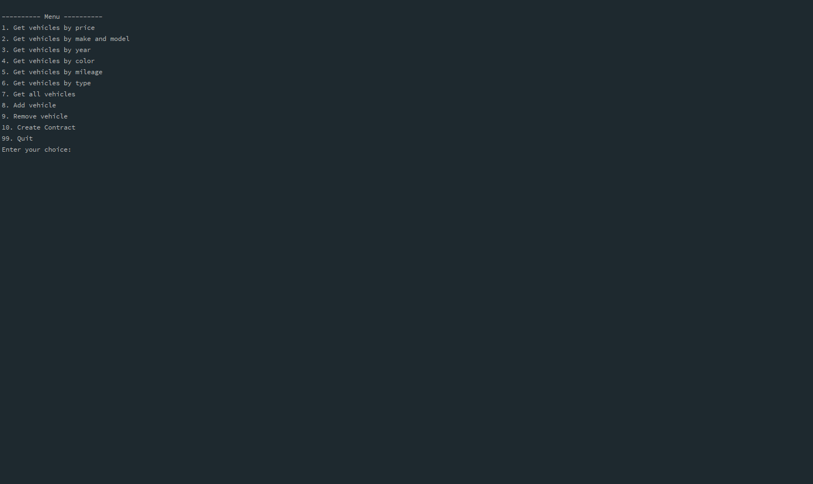

# Adv Car Dealership
A CLI application for managing car dealerships, including all dealership vehicles. The main menu contains functions that allow the user to pull a list of vehicles based on the selected search option. The vehicle list is returned as table that displays the 8 properties of each vehicle. The user is also given the option to remove and add vehicles to ensure up-to-date representation of the dealership.
## Overview

- [Setup](#setup)

- [Features](#features)

- [Demo](#demo)

- [Contribution](#contribution)

## Setup
**Prerequisites**


Make sure Java and Maven are installed on your system.
You can check by running the following commands in your terminal:

```
java -version  
mvn -version
```
If they are not installed, download and install [Java](https://www.oracle.com/java/technologies/javase-downloads.html) and  [Maven](https://maven.apache.org/download.cgi).

**Clone The Repository**

In your terminal, navigate to the directory where you'll keep the project and clone this repository to your local machine. You can do this using the following command:
```
     git clone https://github.com/JalesiaGriffin/adv-car-dealership.git
```
## Features:

- **Vehicle Search:**
  - Find vehicles within a price range.
  - Find vehicles by make/model.
  - Find vehicles by year range.
  - Find vehicles by color.
  - Find vehicles by mileage.
  - Find vehicles by type.

- **Inventory Management:**
  - List all vehicles.
  - Add a vehicle.
  - Remove a vehicle.

- **Contract Management:**
  - Create a contract for sales or leases.

### Sales and Lease Processing:

#### Contract Common Information

- Date (as string) of contract
- Customer name
- Customer email
- Vehicle sold
- Total price
- Monthly payment

#### SalesContract Additional Information

- Sales Tax Amount (5%)
- Recording Fee ($100)
- Processing fee ($295 for vehicles under $10,000 and $495 for all others)
- Whether they want to finance (yes/no)
- Monthly payment (if financed)
  - All loans are at 4.25% for 48 months if the price is $10,000 or more.
  - Otherwise, they are at 5.25% for 24 months.

#### LeaseContract Additional Information

- Expected Ending Value (50% of the original price)
- Lease Fee (7% of the original price)
- Monthly payment based on:
  - All leases are financed at 4.0% for 36 months.

#### Data Collection and Storage:

- When a user selects the sale or lease option, they provide the VIN of the vehicle.
- Data collection includes basic sales information and vehicle details.
- Appends the completed data to a contracts file.
- Supports multiple dealerships with all contracts stored in the same file.

## Demo


## Contribution:

Feel free to contribute to the project by opening issues or submitting pull requests.